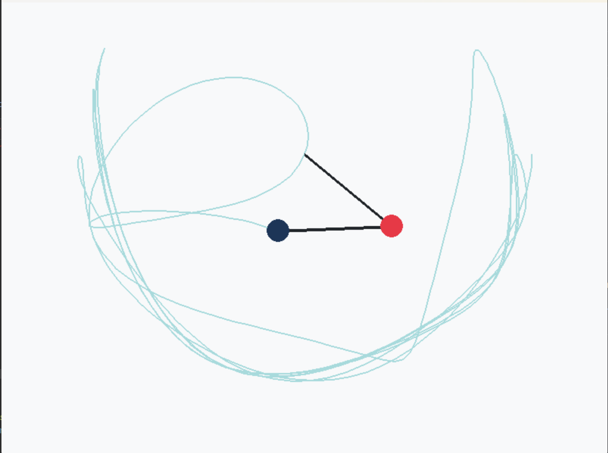

# Chaotic-Double-Pendulum-Simulation
A python program that utilizes pygame to create a double pendulum simulation

# Features
-you are able to change the mass, length, angle, and gravity of the simulation
-the math of the program is using the double pendulum equations of motion (more can be seen at this website: https://ph1-nitk.vlabs.ac.in/exp/double-pendulum/theory.html)

